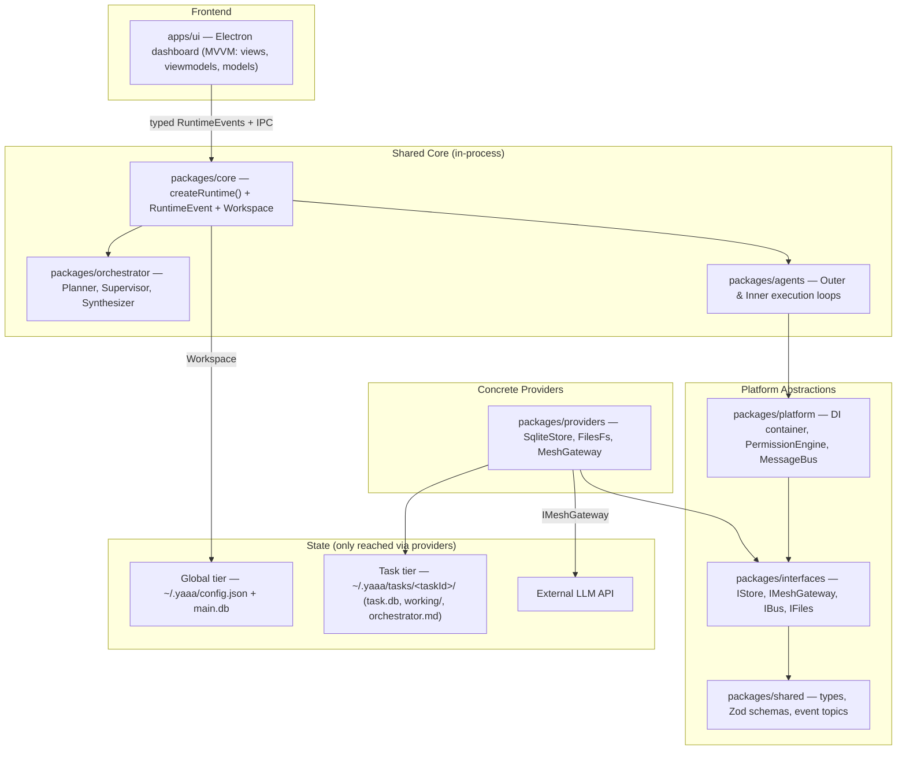

# 🚀 YAAA: Yet Another Agent Architecture

YAAA is a highly modular, event-driven multi-agent framework structured as a TypeScript monorepo. It features a decoupled, clean architecture powered by dependency injection, asynchronous message-bus communication, sandboxed execution verification, and a modern Electron dashboard.

The engine runs **in-process** behind a single typed API. The Electron UI is a thin frontend over that shared core — there is no CLI subprocess and no stdout parsing.

---

## 🏛️ System Architecture

YAAA follows ports-and-adapters (hexagonal) principles: the UI and the agent engine never touch storage directly. Every database, file, and credential access is funneled through the **interface library** and its providers, and state is segregated into a **global** tier (app-wide) and a **task** tier (per-task folder).



### The core contract

`packages/core` is the single composition root and the only surface a frontend talks to:

* **`createRuntime(config)`** — wires the concrete providers (`SqliteStore`, `FilesFs`, `MeshGateway`, `PermissionEngine`, `MessageBus`) into the DI container behind their interfaces, and bridges the internal message bus to a typed event stream.
* **`RuntimeEvent`** — the typed events a frontend renders: `task-started`, `plan-updated`, `thought`, `tool-requested`, `status`, `result`, `complete`. Frontends subscribe via `onEvent`; approvals are answered via `onApproval`.
* **`Workspace`** — owns the **global** tier (`config.json` + `main.db`) and the per-task folder lifecycle (scaffolding, `orchestrator.md`, task listing/history). It is the single place these stores are touched.

Because the engine is a library with a typed API, the Electron main process drives it directly — no subprocess, no text protocol.

---

## 📁 Repository Structure

```
yaaa/
├── apps/
│   └── ui/              # Electron dashboard: views, viewmodels, models, IPC to the core
├── packages/
│   ├── core/            # createRuntime() + RuntimeEvent + Workspace (shared composition root)
│   ├── orchestrator/    # Planning, supervising, and output synthesis
│   ├── agents/          # Inner & outer execution loops for subtasks
│   ├── platform/        # DI container, PermissionEngine, MessageBus
│   ├── interfaces/      # Contract definitions (IStore, IMeshGateway, IBus, IFiles)
│   ├── providers/       # SqliteStore, FilesFs, MeshGateway (concrete implementations)
│   └── shared/          # Types, Zod schemas, and event-topic definitions
├── .agents/AGENTS.md    # AI agent instructions and project rules
├── CLAUDE.md            # Knowledge-graph MCP tools and local commands reference
├── tsconfig.json        # TypeScript project references
└── biome.json           # Biome formatting and linting config
```

---

## ⚙️ Core Components

### 🔄 Orchestration & Loops
* **OuterLoop**: solves the task plan's dependency DAG, checks constraints and sequencing, and writes facts/assumptions onto the task ledger.
* **InnerLoop**: the local execution/verification container that invokes agent templates (`FilesAgent`, `VerifierAgent`) to perform targeted actions.
* **Planner & Supervisor**: the Planner formulates structured steps and the Supervisor watches progress, while the **Synthesizer** combines subtask results into a final answer.

### 🛡️ Platform & Safety
* **Interface library (`packages/interfaces`)**: the only doorway to state. `IStore`, `IMeshGateway`, `IBus`, and `IFiles` are implemented by `packages/providers`; nothing else touches a database, file, or credential directly.
* **State segregation**: global, app-wide state lives in `~/.yaaa` (`config.json`, `main.db`); per-task state lives inside `~/.yaaa/tasks/<taskId>/` (`databases/task.db`, `working/`, `orchestrator.md`), so a task is isolated and portable.
* **Event Bus (`IBus`)**: asynchronous, topic-based pub/sub powering live status updates, surfaced to the UI as typed `RuntimeEvent`s.
* **Permissions (`PermissionEngine`)**: enforces capability/path scoping and human-in-the-loop approval for gated tool calls.

---

## 🚀 Getting Started

### Prerequisites
* **Node.js** `v18` or higher
* **npm** `v9` or higher

### Installation & Build

```bash
npm install
npm run build   # tsc -b across the project references
```

> **Native modules:** the core uses `better-sqlite3`, which now loads inside the Electron main process. If you hit an ABI mismatch when launching the UI, rebuild it for Electron once with `npx electron-rebuild` (or `npm rebuild better-sqlite3`).

### Running the app

```bash
npm run dev:ui   # starts the Electron dashboard (Vite renderer + Electron main)
```

Configuration (Mesh API key, preferred models, and your personalization profile) is managed in-app through the onboarding flow and persisted to `~/.yaaa/config.json`.

---

## 🧪 Testing, Linting & Formatting

```bash
npm test         # Vitest unit tests with coverage
npm run lint     # Biome lint
npm run format   # Biome format --write
```

---

## 📊 Knowledge Graph integration

This codebase is configured with a persistent knowledge graph via `code-review-graph` to improve navigation and reduce token usage during AI interactions.

* **Rebuild Graph**:
  ```bash
  CRG_DATA_DIR="$HOME/.code-review-graph/yaaa" code-review-graph build --repo "$(pwd)"
  ```
* **Check Status**:
  ```bash
  CRG_DATA_DIR="$HOME/.code-review-graph/yaaa" code-review-graph status --repo "$(pwd)"
  ```
