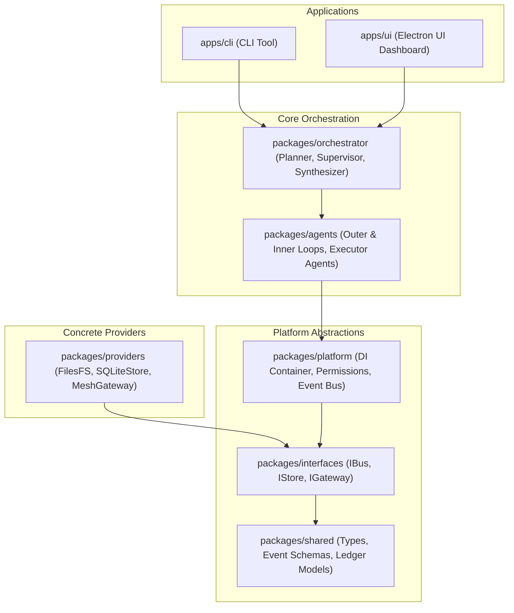

# 🚀 YAAA: Yet Another Agent Architecture

YAAA is a highly modular, event-driven multi-agent framework structured as a TypeScript monorepo. It features a complete decoupled architecture powered by dependency injection, asynchronous message-bus communications, sandboxed execution verification, and a modern Electron dashboard.

---

## 🏛️ System Architecture

YAAA is built on clean architecture principles, separating core domain abstractions from concrete providers and external application layers.



---

## 📁 Repository Structure

```
yaaa/
├── apps/
│   ├── cli/             # Command-Line Interface to initiate and manage tasks
│   └── ui/              # Electron-based dashboard, VM views, and approval workflows
├── packages/
│   ├── agents/          # Inner & outer execution loops for executing subtasks
│   ├── interfaces/      # Contract definitions (IBus, IStore, IGateway)
│   ├── orchestrator/    # Planning, supervising, and output synthesizing logic
│   ├── platform/        # Dependency Injection (DI), permissions, and central event bus
│   ├── providers/       # SQLite storage, local file system, and mesh gateway providers
│   └── shared/          # Shared schemas, Zod definitions, types, and event structures
├── .agents/
│   └── AGENTS.md        # AI Agent instructions, project rules, and token saving guidelines
├── CLAUDE.md            # Knowledge graph MCP tools and local commands reference
├── tsconfig.json        # TypeScript configuration utilizing project references
└── biome.json           # Biome configuration for formatting and linting
```

---

## ⚙️ Core Components

### 🔄 Orchestration & Loops
* **OuterLoop**: Solves the task plan's dependency DAG, checking constraints and sequential execution status, and writes facts and assumptions onto the task ledger.
* **InnerLoop**: The local execution and verification container that invokes agent templates (`FilesAgent`, `VerifierAgent`) to perform targeted actions.
* **Planner & Supervisor**: Formulates structured steps and watches progress, while the **Synthesizer** combines subtask results into final answers.

### 🛡️ Platform & Safety
* **Event Bus (`IBus`)**: Asynchronous, topic-based event-driven pub/sub communication channels powering notifications and status updates.
* **Dependency Injection (`container`)**: A platform-wide IoC registry to resolve interface bindings decouple implementations from orchestration.
* **Permissions Manager**: Enforces security boundaries and sandboxed execution over platform activities.

---

## 🚀 Getting Started

### Prerequisites
* **Node.js**: `v18` or higher
* **npm**: `v9` or higher

### Installation & Build

1. Clone and install dependencies:
   ```bash
   npm install
   ```

2. Build all packages using TypeScript Project References:
   ```bash
   npm run build
   ```

### Running Applications

* **Start Electron UI Dashboard**:
  ```bash
  npm run dev:ui
  ```

* **Run CLI**:
  ```bash
  node apps/cli/dist/index.js
  ```

---

## 🧪 Testing, Linting & Formatting

YAAA uses modern tooling for testing and linting to maintain a high-quality codebase.

* **Run Tests with Coverage**:
  ```bash
  npm test
  ```
  *(Uses Vitest to execute individual unit tests for all packages and generates a coverage summary).*

* **Lint Codebase**:
  ```bash
  npm run lint
  ```

* **Format Codebase**:
  ```bash
  npm run format
  ```

---

## 📊 Knowledge Graph integration

This codebase is configured with a persistent knowledge graph via `code-review-graph` to improve navigation and reduce token usage during AI interactions.

* **Rebuild Graph**:
  ```bash
  CRG_DATA_DIR="$HOME/.code-review-graph/yaaa" npx code-review-graph build
  ```
* **Check Status**:
  ```bash
  CRG_DATA_DIR="$HOME/.code-review-graph/yaaa" npx code-review-graph status
  ```
