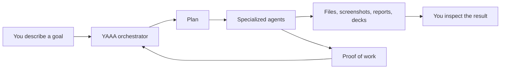
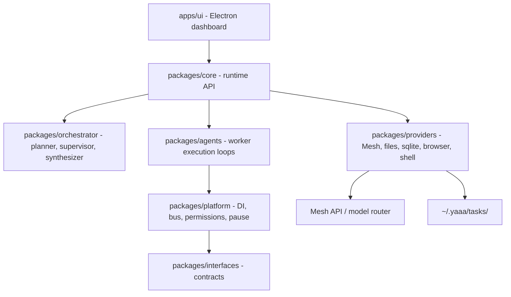

# YAAA

YAAA means **Yet Another AI Agent**.

It is a desktop mission-control app for running teams of AI agents. You tell it what you want done. YAAA plans the work, chooses suitable agents and models, gives each agent instructions, watches progress, collects proof, and keeps the output in a task workspace.

Think of it less like chatting with one bot and more like directing a small project team.

## Start Here

**To start YAAA on macOS or Linux, run:**

```bash
sh scripts/start-ui.sh
```

**To start YAAA on Windows, double-click or run:**

```bat
scripts\start-windows.bat
```

These startup files check for Node.js/npm, try to install missing prerequisites where possible, run `npm install`, rebuild Electron native modules, and launch the desktop app.

If startup fails after installing Node.js, close and reopen your terminal so your PATH refreshes, then run the same command again.

## What You Can Do With It

Use YAAA when a task needs more than one simple answer:

- Research something and produce a verified report.
- Create or inspect documents, slides, spreadsheets, images, and PDFs.
- Ask agents to work in files, run commands, browse the web, and verify results.
- Let one agent create work and another inspect it.
- Keep handoff notes, proof, and artifacts organized automatically.

YAAA stores task outputs under `~/.yaaa/tasks/<taskId>/working/`, so generated files are not meant to appear randomly in the code directory.

## How It Feels In Use

1. You enter a mission.
2. YAAA proposes a plan.
3. You accept or revise the plan.
4. Specialist agents start working.
5. The UI shows agent activity, browser/search evidence, generated artifacts, and proof of work.
6. The orchestrator decides whether the work is done, needs revision, or should continue with another agent.



## Why It Exists

Most AI tools make the user act as the project manager. You decide which model to use, copy context between tools, open browser tabs, run commands, check output, and remember what has already been proven.

YAAA moves that coordination into the system:

- A planner breaks down the mission.
- Mesh-backed routing picks models for the kind of work.
- Agents get written instructions in `handsOn.md`.
- Agents produce proof and handoff notes.
- The app keeps task state, artifacts, and continuation context together.

## Architecture

YAAA is a TypeScript monorepo with an Electron dashboard on top of a local agent runtime.



### Packages

- `apps/ui`: Electron and React dashboard.
- `packages/core`: runtime composition, task lifecycle, event API, workspace management.
- `packages/orchestrator`: planning, supervision, synthesis, and routing decisions.
- `packages/agents`: worker loops, agent registry, tool execution, verification flow.
- `packages/platform`: dependency injection, permissions, message bus, pause/cancel support.
- `packages/interfaces`: contracts for gateways, stores, files, buses, and capabilities.
- `packages/providers`: Mesh, SQLite, filesystem, browser/search, shell, and screenshot providers.
- `packages/shared`: shared schemas, events, types, errors, and mission context.

## Agent Workflow

YAAA uses explicit files so agent work is inspectable and resumable.

### `handsOn.md`

Created by the orchestrator when an agent starts. It contains:

- The assigned objective.
- Success criteria.
- Capability and role.
- Dependencies.
- Workspace boundaries.
- Required proof-of-work and handoff expectations.

### Proof of Work

Created by the worker agent. It may include:

- Markdown summaries.
- Source files.
- Screenshots.
- Generated assets.
- Test output.
- Research notes.
- Metadata about created artifacts.

### `handOff.md`

Created when the worker finishes. It should include:

- Work completed.
- Observations and decisions.
- Files and assets created.
- Tests or checks performed.
- Risks and limitations.
- Suggested next steps.
- Instructions for a future agent.

The orchestrator uses this document to decide the next move.

## Agent Roster

The planner can route subtasks to these agent templates:

- `ResearcherAgent` for web research and factual synthesis.
- `FilesAgent` for general file and document work.
- `DocumentAgent` for reports, Markdown documents, PowerPoint/PPTX, slide outlines, speaker notes, spreadsheets, and non-code content artifacts.
- `PrincipalSweAgent` for backend and complex software engineering.
- `UiArchitectAgent` for frontend and interface engineering.
- `GraphicsEngineerAgent` for rendering, geometry, graphics, and WebGL.
- `DesignerAgent` for visual and brand design.
- `AdStrategistAgent` for marketing and campaign strategy.
- `DevOpsAgent` for infrastructure, deployment, and operations.
- `QaTesterAgent` for functional and automated verification.
- `CvTesterAgent` for visual, screenshot, and GUI verification.

## Mesh Integration

Mesh is the model routing layer. YAAA uses it to make task-specific model choices instead of sending every step to the same model.

Current routing intent:

- Default planning and worker execution: Gemini Flash-class models to keep routine agent turns fast and cost-effective.
- Complex coding, architecture, hard debugging, and high-stakes product/layout decisions: Claude Sonnet-class models when explicitly assigned.
- Research, browser/search tasks, document generation, and PPT/content creation: Gemini Flash-class models.
- Verification and simple file QA: faster lightweight models.

Important files:

- `packages/providers/src/mesh-gateway.ts`: provider that talks to the Mesh/OpenAI-compatible API.
- `packages/core/src/runtime.ts`: wires `MeshGateway` into the runtime and exposes model access to agents.
- `packages/orchestrator/src/planner.ts`: asks the planner model to create subtasks, agent choices, routing reasons, and model selections.
- `packages/agents/src/runtime/inner-loop.ts`: runs worker agents and routes model calls during execution.

When no API key is configured, YAAA includes deterministic mock behavior so local demos and tests can still exercise the task lifecycle.

## Web Research

YAAA uses browser UI search instead of a direct scraping API path. This avoids repeated anomaly/rate-limit failure patterns from API scraping. The current `web.search` implementation opens a browser-backed search page and extracts visible search results from the UI.

Relevant file:

- `packages/providers/src/web-search-tool.ts`

## Product Surface

YAAA ships as an Electron dashboard. The app shows:

- Mission chat.
- Plan review and acceptance.
- Running subtasks.
- Agent status cards.
- Artifacts and generated files.
- Working folder links.
- Todo and progress state.
- Universal viewers for markdown, code, PDFs, spreadsheets, presentations, images, and Mermaid diagrams.

The runtime runs in-process behind typed APIs. The UI does not scrape stdout from a CLI subprocess.

## Local State

YAAA stores user and task data under `~/.yaaa`.

- `~/.yaaa/config.json`: local app configuration, Mesh API key, model preferences, and profile data.
- `~/.yaaa/main.db`: global app database.
- `~/.yaaa/tasks/<taskId>/`: per-task database and working folder.
- `~/.yaaa/tasks/<taskId>/working/agent-workspaces/<agentId>/`: agent-specific workspace files such as `handsOn.md`, proof of work, and `handOff.md`.

## Technical Setup

### Requirements

- Node.js from `.nvmrc` is recommended.
- npm is required.
- macOS and Linux use `scripts/start-ui.sh`.
- Windows uses `scripts/start-windows.cmd`.

Manual install:

```bash
npm install
```

Manual run:

```bash
npm start
```

or:

```bash
npm run dev:ui
```

### Build

```bash
npm run build
```

### Test

```bash
npm test
```

### Lint and Format

```bash
npm run lint
npm run format
```

### End-to-End Tests

```bash
npm run e2e
```

### Electron Native Module Rebuild

If `better-sqlite3` reports an Electron ABI mismatch:

```bash
npm run rebuild:electron
```

If tests report a `better-sqlite3` Node ABI mismatch after running the Electron app:

```bash
npm rebuild better-sqlite3
```

Electron and your system Node may require different native builds of the same module.

## Configuration

Set the Mesh API key and model preferences through the app onboarding/settings flow. The app persists configuration locally under `~/.yaaa/config.json`.

Useful runtime environment variables:

- `YAAA_MAX_TURNS`: maximum worker loop turns before the agent is stopped.
- `YAAA_AGENT_INVOKE_TIMEOUT_MS`: wall-clock timeout for one worker invocation.
- `YAAA_AGENT_FIRST_PROGRESS_TIMEOUT_MS`: max wait for a worker model to produce its first tool progress before retrying.
- `YAAA_TIMEOUT` or `MESH_TIMEOUT`: fallback timeout values for model calls.
- `YAAA_MAX_TOOL_OUTPUT`: max characters from a tool observation fed back to a model.

## Development Notes

- The project uses TypeScript project references with `tsc -b`.
- Unit tests run with Vitest.
- E2E tests run with Playwright.
- Formatting and linting use Biome at the root, with the UI also using oxlint.
- The codebase is configured for `code-review-graph` to help agents navigate architecture and review changes.

## Hackathon Pitch

**Project title:** YAAA (Yet Another AI Agent)

**Track:** Agents & Automation

**One-paragraph pitch:** YAAA is an autonomous multi-agent orchestration platform that changes how people interact with agents. Just as AiFiesta made many AI APIs easier to use through one subscription, YAAA gives users one place to launch, route, supervise, and continue complex agent work. Based on the task, YAAA decides which specialized agent and which model is the best fit, splits the mission into focused subtasks, gives each worker detailed instructions, then reviews each handoff before continuing.

**Repo:** https://github.com/Yet-Another-AI-Agent/YAAA

**Mesh usage:** Mesh is used through the model gateway in `packages/providers/src/mesh-gateway.ts`, then wired into planning and execution through `packages/core/src/runtime.ts`, `packages/orchestrator/src/planner.ts`, and `packages/agents/src/runtime/inner-loop.ts`.

## Current Status

Implemented:

- Electron dashboard.
- Runtime composition API.
- Planner, supervisor, and worker execution loops.
- Mesh/OpenAI-compatible gateway.
- Agent template routing.
- Per-agent `handsOn.md` creation.
- Worker proof-of-work and handoff expectations.
- Browser UI search.
- Filesystem, shell, browser, and screenshot-capable providers.
- Local SQLite-backed task state.

In progress:

- Stronger orchestrator review of worker `handOff.md` before spawning follow-up agents.
- More complete proof-of-work metadata.
- Richer artifact indexing and preview.
- More precise model routing heuristics.
- Hosted demo and final hackathon video.

## Vision

YAAA is a step toward agent-native computing. Users should not need to know whether a task belongs in Claude, Codex, a browser, a document worker, or a specific model. The user should state the mission. YAAA should assemble the team, route work through Mesh, verify progress, preserve context, and keep moving until the work is genuinely done.
