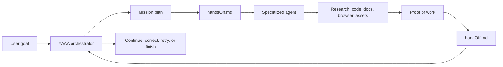
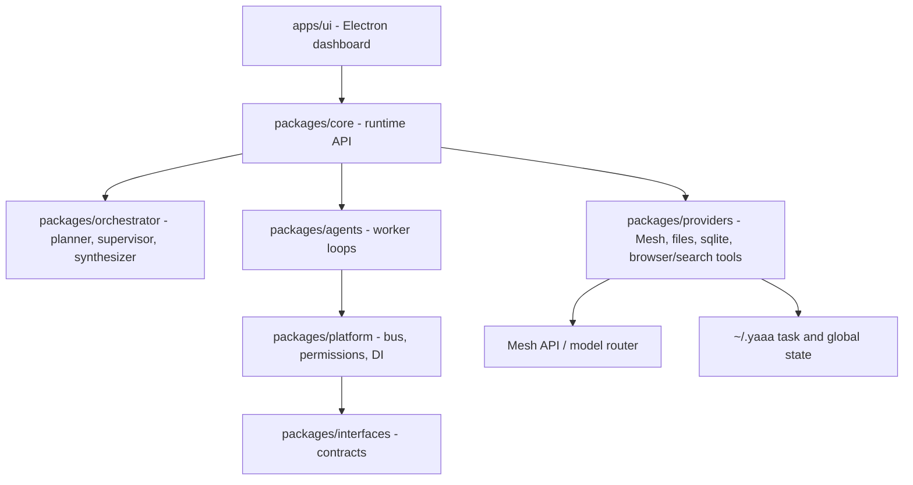

# YAAA: Yet Another AI Agent

YAAA is a multi-agent orchestration platform for people who want agents to work together instead of living in separate tabs, tools, and subscriptions. Just as AiFiesta made many AI APIs easier to access through one subscription, YAAA changes how people interact with agents: you give it a goal, and it decides which agent, tool, and model should handle each part of the work. A research task can go to a researcher agent, a code task can go to Codex-style workers, a document task can go to a Claude Cowork-style agent, and the orchestrator keeps the mission moving until there is proof of work and a final handoff.

YAAA is built for developers, creators, students, and operators who want one command center for complex work. Instead of asking one model to do everything, YAAA breaks the mission into subtasks, creates clear `handsOn.md` instructions for each worker, supervises progress, reviews each `handOff.md`, and course-corrects by spinning up new agents when the work needs more research, verification, or refinement.

## Hackathon Submission

**Project title:** YAAA (Yet Another AI Agent)

**Track:** Agents & Automation

**Pitch:** YAAA is an autonomous multi-agent workbench that routes work across specialized agents and models. It uses Mesh to choose the right model for the right subtask, then coordinates agents that can research, code, create documents, verify outputs, and hand off work with structured evidence. The result is a new way to work with AI agents: not one chat box, but an intelligent mission control layer that can divide a task, supervise execution, inspect proof of work, and decide the next best action.

**GitHub repo:** https://github.com/Yet-Another-AI-Agent/YAAA

## Why YAAA

Most AI workflows still depend on the user becoming the orchestrator. People copy context from ChatGPT to Claude, from Claude to Codex, from Codex to browser tools, then manually remember what happened and what still needs to be done.

YAAA moves that coordination layer into the product.

- One mission can be split into many focused subtasks.
- Each subtask gets a dedicated agent with detailed `handsOn.md` instructions.
- Agents produce proof of work through text, files, images, screenshots, metadata, and observations.
- Every completed agent writes a `handOff.md` with what it did, what it learned, what assets it created, and how another agent can continue.
- The orchestrator reads the handoff before deciding whether to continue, revise, retry, or assign follow-up work.
- Mesh lets YAAA route subtasks to the model best suited for that piece of the mission.

## Mesh Integration

Mesh is used as the model routing layer for YAAA's agents.

Key files:

- `packages/providers/src/mesh-gateway.ts` implements the Mesh/OpenAI-compatible gateway used to call routed models.
- `packages/core/src/runtime.ts` wires `MeshGateway` into the runtime dependency container.
- `packages/orchestrator/src/planner.ts` uses the model gateway for mission planning and task decomposition.
- `packages/agents/src/runtime/inner-loop.ts` uses the gateway while worker agents execute subtasks.

The goal is for Mesh to become the decision layer behind model selection: lightweight planning can use fast models, deep research can use stronger reasoning models, coding can go to Codex-style agents, document and workflow tasks can go to Claude Cowork-style agents, and final synthesis can use the model best suited for judgment and clarity.

## How It Works



## Core Features

- Mission planning and subtask decomposition.
- Orchestrator-controlled `handsOn.md` task briefs.
- Agent-generated proof of work and `handOff.md` reports.
- Mid-mission course correction based on worker findings.
- Mesh-backed model routing through a shared gateway.
- Electron dashboard for live mission status, artifacts, todos, and agent progress.
- Browser UI search for web research, avoiding brittle search API rate limits.
- Extensible architecture for Claude, Codex, Cowork, browser, document, and custom worker agents.

## Architecture

YAAA is a TypeScript monorepo with a clean ports-and-adapters structure. The UI talks to a typed runtime API, and the runtime composes orchestrator, agent, platform, and provider packages behind interfaces.



## Repository Structure

```text
yaaa/
  apps/
    ui/                  Electron dashboard
  packages/
    core/                Runtime composition and public event API
    orchestrator/        Planning, supervision, and synthesis
    agents/              Inner and outer worker execution loops
    platform/            Dependency injection, permissions, message bus
    interfaces/          Contracts for stores, files, buses, and gateways
    providers/           Mesh gateway, sqlite, filesystem, browser/search tools
    shared/              Shared types, schemas, and events
```

## Getting Started

Prerequisites:

- Node.js 18 or higher
- npm 9 or higher

Install and build:

```bash
npm install
npm run build
```

Run the Electron app:

```bash
npm run dev:ui
```

Configuration, including Mesh API keys and preferred models, is managed inside the app and persisted under `~/.yaaa/config.json`.

## Testing

```bash
npm test
npm run lint
npm run format
```

Native module note: if `better-sqlite3` reports an Electron ABI mismatch, rebuild it with:

```bash
npx electron-rebuild
```

## Vision

YAAA is a step toward agent-native computing. The user should not need to know whether a task belongs in Claude, Codex, a browser, a document worker, or a specific model. The user should state the mission. YAAA should assemble the right team, route each piece through Mesh, verify the work, and keep enough structured handoff context that the next agent can continue without starting from zero.
