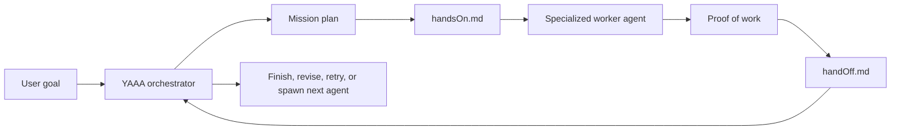
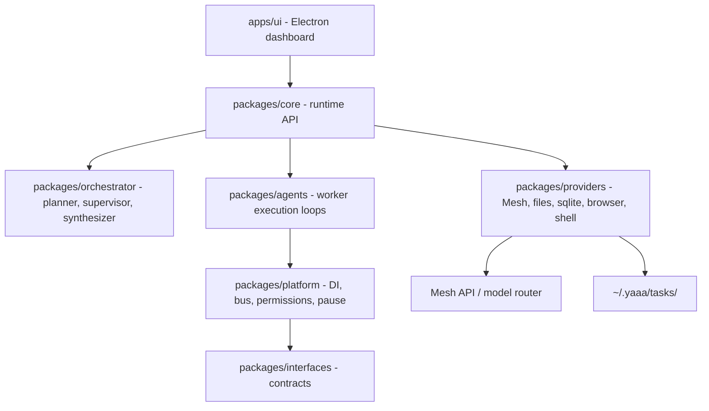

# YAAA

Yet Another AI Agent is a desktop mission-control app for running teams of AI agents. You describe the outcome you want, YAAA plans the work, chooses the right agent and model for each part, watches execution, collects proof, and decides what should happen next.

Most AI products still make the user act as the orchestrator. You ask one model for research, move to another for code, open a browser for sources, paste notes into a document tool, then manually remember what each step proved. YAAA moves that coordination into the system. It is designed to make working with agents feel less like managing a pile of tabs and more like directing a capable team.

## Hackathon Pitch

**Project title:** YAAA (Yet Another AI Agent)

**Track:** Agents & Automation

**One-paragraph pitch:** YAAA is an autonomous multi-agent orchestration platform that changes how people interact with agents. Just as AiFiesta made many AI APIs easier to use through one subscription, YAAA gives users one place to launch, route, supervise, and continue complex agent work. Based on the task, YAAA decides which specialized agent and which model is the best fit, splits the mission into focused subtasks, gives each worker detailed instructions, then reviews each handoff before continuing. It can coordinate research agents, Codex-style coding agents, Claude Cowork-style document/workflow agents, browser agents, QA agents, and custom workers through a single mission layer powered by Mesh routing.

**Repo:** https://github.com/Yet-Another-AI-Agent/YAAA

**Mesh usage:** Mesh is used through the model gateway in `packages/providers/src/mesh-gateway.ts`, then wired into planning and execution through `packages/core/src/runtime.ts`, `packages/orchestrator/src/planner.ts`, and `packages/agents/src/runtime/inner-loop.ts`.

## What YAAA Does

YAAA turns one user goal into a supervised multi-agent workflow:

1. The user enters a mission.
2. The orchestrator creates a structured plan.
3. Each subtask is assigned to a specialized agent template and model.
4. The orchestrator writes `handsOn.md` for the worker with detailed instructions.
5. The worker executes using allowed tools such as files, shell, browser, docs, and verification.
6. The worker creates proof of work and a final `handOff.md`.
7. The orchestrator reads the handoff and decides whether to finish, revise, retry, or spin up another agent.

This means YAAA can course-correct mid-mission instead of blindly running a static plan.



## Why It Matters

AI agents are powerful, but using them together is still awkward. The user has to know which tool to use, when to switch models, what context to copy, and how to verify the result. YAAA treats orchestration as the product.

- A planning agent breaks down the mission.
- Mesh-backed model routing chooses suitable models for subtasks.
- Specialized agents handle research, code, UI, documents, verification, operations, and browser tasks.
- Handoffs preserve context so another agent can continue without starting from zero.
- The Electron dashboard shows live status, artifacts, todos, working folders, and agent progress.

## Agent Workflow

YAAA uses explicit handoff files so work is inspectable and resumable.

### `handsOn.md`

Created by the orchestrator when an agent starts. It contains:

- The assigned objective.
- Success criteria.
- Capability and role.
- Dependencies.
- Workspace boundaries.
- Required proof-of-work and handoff expectations.

### Proof of Work

Created by the worker agent. It may include:

- Markdown summaries.
- Source files.
- Screenshots.
- Generated assets.
- Test output.
- Research notes.
- Metadata about created artifacts.

### `handOff.md`

Created when the worker finishes. It should include:

- Work completed.
- Observations and decisions.
- Files and assets created.
- Tests or checks performed.
- Risks and limitations.
- Suggested next steps.
- Instructions for a future agent.

The orchestrator uses this document to decide the next move.

## Agent Roster

The planner can route subtasks to these agent templates:

- `ResearcherAgent` for web research and factual synthesis.
- `FilesAgent` for general file and document work.
- `PrincipalSweAgent` for backend and complex software engineering.
- `UiArchitectAgent` for frontend and interface engineering.
- `GraphicsEngineerAgent` for rendering, geometry, graphics, and WebGL.
- `DesignerAgent` for visual and brand design.
- `AdStrategistAgent` for marketing and campaign strategy.
- `DevOpsAgent` for infrastructure, deployment, and operations.
- `QaTesterAgent` for functional and automated verification.
- `CvTesterAgent` for visual, screenshot, and GUI verification.

YAAA is built so this roster can grow to include Claude Cowork-style agents, Codex-style coding workers, browser automation workers, document workers, and project-specific custom agents.

## Mesh Integration

Mesh is the model routing layer. YAAA uses it to make task-specific model choices instead of sending every step to the same model.

Current routing intent:

- Planning and complex coding: stronger reasoning models such as Claude Sonnet-class models.
- Research and general generation: Gemini-class models.
- Verification and simple file QA: faster lightweight models.
- Future routing: dynamically select between Claude, Codex-style workers, Cowork-style workers, and other model providers based on task type, cost, latency, and confidence.

Important files:

- `packages/providers/src/mesh-gateway.ts`: provider that talks to the Mesh/OpenAI-compatible API.
- `packages/core/src/runtime.ts`: wires `MeshGateway` into the runtime and exposes model access to agents.
- `packages/orchestrator/src/planner.ts`: asks the planner model to create subtasks, agent choices, routing reasons, and model selections.
- `packages/agents/src/runtime/inner-loop.ts`: runs worker agents and routes model calls during execution.

When no API key is configured, YAAA includes deterministic mock behavior so local demos and tests can still exercise the task lifecycle.

## Web Research

YAAA uses browser UI search instead of the DuckDuckGo API path. This avoids the repeated anomaly/rate-limit failure pattern from API scraping. The current `web.search` implementation opens a browser-backed search page and extracts visible search results from the UI.

Relevant file:

- `packages/providers/src/web-search-tool.ts`

## Product Surface

YAAA ships as an Electron dashboard. The app shows:

- Mission chat.
- Plan review and acceptance.
- Running subtasks.
- Agent status cards.
- Artifacts and generated files.
- Working folder links.
- Todo and progress state.
- Universal viewers for markdown, code, PDFs, spreadsheets, presentations, images, and Mermaid diagrams.

The runtime runs in-process behind typed APIs. The UI does not scrape stdout from a CLI subprocess.

## Architecture

YAAA is a TypeScript monorepo with packages split by responsibility.



### Packages

- `apps/ui`: Electron and React dashboard.
- `packages/core`: runtime composition, task lifecycle, event API, workspace management.
- `packages/orchestrator`: planning, supervision, synthesis, and routing decisions.
- `packages/agents`: worker loops, agent registry, tool execution, verification flow.
- `packages/platform`: dependency injection, permissions, message bus, pause/cancel support.
- `packages/interfaces`: contracts for gateways, stores, files, buses, and capabilities.
- `packages/providers`: concrete integrations for Mesh, SQLite, filesystem, browser/search, shell, and screenshots.
- `packages/shared`: shared schemas, events, types, errors, and mission context.

## Local State

YAAA stores user and task data under `~/.yaaa`.

- `~/.yaaa/config.json`: local app configuration, Mesh API key, model preferences, and profile data.
- `~/.yaaa/main.db`: global app database.
- `~/.yaaa/tasks/<taskId>/`: per-task database and working folder.
- `~/.yaaa/tasks/<taskId>/working/agent-workspaces/<agentId>/`: agent-specific workspace files such as `handsOn.md`, proof of work, and `handOff.md`.

## Getting Started

### Requirements

- Node.js 20.x is recommended.
- npm 10.x is recommended.
- macOS is the primary development target right now because the product is an Electron desktop app.

### Install

```bash
npm install
```

### Run the app

```bash
npm start
```

or:

```bash
npm run dev:ui
```

### Build

```bash
npm run build
```

### Test

```bash
npm test
```

### Lint and format

```bash
npm run lint
npm run format
```

### End-to-end tests

```bash
npm run e2e
```

### Electron native module rebuild

If `better-sqlite3` reports an Electron ABI mismatch:

```bash
npm run rebuild:electron
```

## Configuration

Set the Mesh API key and model preferences through the app onboarding/settings flow. The app persists configuration locally under `~/.yaaa/config.json`.

Useful runtime environment variables:

- `YAAA_MAX_TURNS`: maximum worker loop turns before the agent is stopped.
- `YAAA_AGENT_INVOKE_TIMEOUT_MS`: wall-clock timeout for one worker invocation.
- `YAAA_TIMEOUT` or `MESH_TIMEOUT`: fallback timeout values for model calls.
- `YAAA_MAX_TOOL_OUTPUT`: max characters from a tool observation fed back to a model.

## Development Notes

- The project uses TypeScript project references with `tsc -b`.
- Unit tests run with Vitest.
- E2E tests run with Playwright.
- Formatting and linting use Biome at the root, with the UI also using oxlint.
- The codebase is configured for `code-review-graph` to help agents navigate architecture and review changes.

## Current Status

Implemented:

- Electron dashboard.
- Runtime composition API.
- Planner, supervisor, and worker execution loops.
- Mesh/OpenAI-compatible gateway.
- Agent template routing.
- Per-agent `handsOn.md` creation.
- Worker proof-of-work and handoff expectations.
- Browser UI search.
- Filesystem, shell, browser, and screenshot-capable providers.
- Local SQLite-backed task state.

In progress:

- Stronger orchestrator review of worker `handOff.md` before spawning follow-up agents.
- More complete proof-of-work metadata.
- Richer artifact indexing and preview.
- More precise model routing heuristics.
- Hosted demo and final hackathon video.

## Submission Checklist

- Registered Mesh email: add in the hackathon form.
- Teammate emails: add if applicable.
- GitHub repo URL: https://github.com/Yet-Another-AI-Agent/YAAA
- Demo video URL: add Loom or YouTube link.
- Pitch deck URL: optional.
- Live demo URL: optional.
- Mesh integration file: `packages/providers/src/mesh-gateway.ts`

## Vision

YAAA is a step toward agent-native computing. Users should not need to know whether a task belongs in Claude, Codex, a browser, a document worker, or a specific model. The user should state the mission. YAAA should assemble the team, route work through Mesh, verify progress, preserve context, and keep moving until the work is genuinely done.
