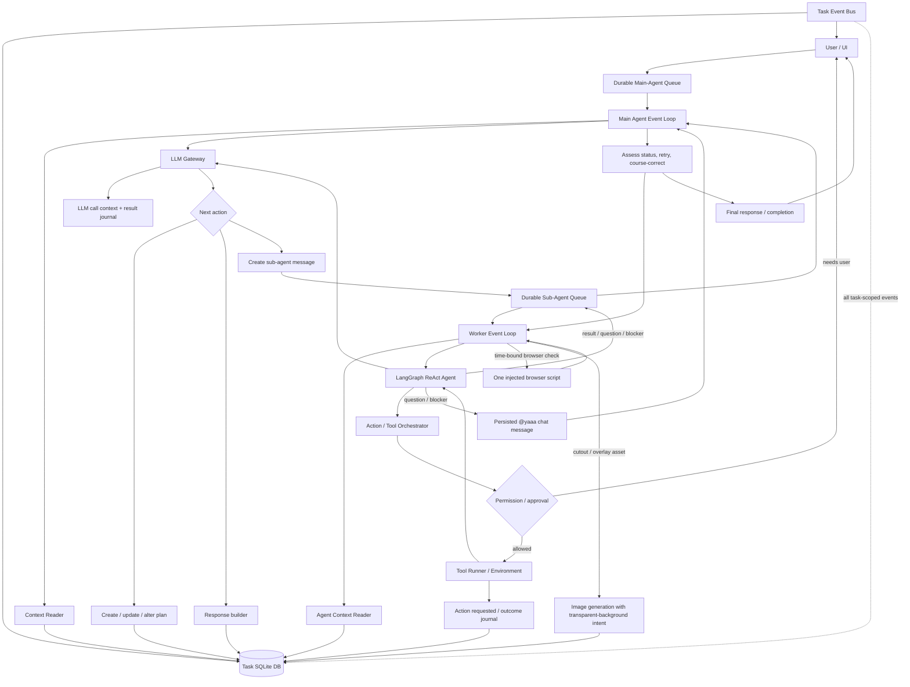

# Agent event-loop architecture: comparison and implementation plan

## What exists today

The repository already has the two important execution levels:

1. `Supervisor`/`OuterLoop` creates a plan, schedules dependency-ready
   subtasks concurrently, persists plan/ledger/agent snapshots, retries failed
   work, handles verification rounds, and polls the orchestrator mailbox.
2. `InnerLoop` runs each worker as a LangGraph `createReactAgent` ReAct graph.
   Native tool calls are permission-gated and approval-aware; LangGraph's
   recursion limit is a safety backstop and the existing wall-clock watchdog,
   pause controller, stop/redirect directives, and artifact reconciliation are
   retained.

The diagrams describe the same split, but make several runtime contracts
explicit that the current implementation only handled partially:

| Concern | Current implementation | Target architecture | Change |
| --- | --- | --- | --- |
| Main event loop | OuterLoop polling plus in-memory mailbox | Durable main-agent queue with sleep/wake and restart recovery | Keep loop; mailbox now hydrates, leases, retries, and acknowledges through SQLite |
| Worker event loop | LangGraph ReAct transcript in memory | Per-agent context DB, tool orchestrator, permission gate, watcher | Keep LangGraph; assignments now cross a durable agent-queue lease and each pre-model context/tool action is journaled |
| LLM context | Planner/gateway requests and worker initial prompt are not uniformly recorded | Every call has model, role, input context, output, retry, and error records | Add `llm.call.*` records around the runtime gateway and `llm_context` records at each LangGraph turn |
| Actions | Native tool calls and approval events exist, but only AgentMessage-shaped events are persisted | Requested, approved/denied, started, completed/failed actions are queryable | Explicit action lifecycle events are journaled; `SqliteTaskReader` exposes action projections |
| Storage | Snapshot interfaces for messages/plans/ledger/audit/agents | Read abstractions over an append-only event stream plus existing projections | Add `RuntimeEvent`, queue, and `ITaskReader` contracts with SQLite implementations |
| Observability | Console logs and UI bus events | DB is source of truth; UI remains a projection | Bus now journals all `task.*` events before the legacy AgentMessage projection |
| Plan changes | Existing plan persistence and plan-updated events | Explicit plan create/update/delete/alter history | Existing plan snapshot remains; event journal preserves each change |

## Implementation phases

### Phase 1 — durable event contract (implemented)

- Add the shared `RuntimeEvent` envelope with task and optional agent/run
  correlation fields.
- Add optional `saveRuntimeEvent`/`getRuntimeEvents` methods to `IStore`, so
  alternate stores and test doubles can adopt the contract without breaking
  existing implementations.
- Add an append-only `runtime_events` SQLite table and indexed read methods.
- Make `MessageBus` persist every `task.*` event while retaining the existing
  `AgentMessage` projection for current UI and compatibility.

### Phase 2 — LLM trace contract (implemented)

- Wrap the composition-root gateway so planner, intent, synthesis, topic, and
  conversational calls record `llm.call.started`, `llm.call.completed`, and
  `llm.call.failed`, including the exact message context and options used.
- Use the existing LangGraph `preModelHook` as the authoritative per-turn
  boundary for workers and persist the sanitized messages, model, template, and
  turn number as `llm_context`.
- Keep secrets out of records: API keys remain configuration, not message data.

### Phase 3 — explicit durable queues (implemented)

- Introduced `IQueueStore`/`IEventQueue` with enqueue, claim, acknowledge,
  retry, lease expiry, and wait-for-work operations.
- Implemented SQLite-backed queue items with leases, idempotent item IDs, and
  task-scoped wake signals. The in-memory mailbox remains a fast local adapter
  and hydrates from the durable queue after restart.
- Main-agent messages and worker assignments both cross the durable queue;
  existing bounded polling remains as a watchdog for control directives.

### Phase 4 — action and context projections (implemented)

- Added typed runtime action records for requested/completed/failed tool
  actions, while the existing permission engine remains the approval owner.
- Added `ITaskReader` and `SqliteTaskReader` for task and agent context,
  including plans, ledger, messages, event history, and projected actions.
- The worker still owns prompt assembly and passes compact context to LangGraph;
  the reader is available for restart/replay and future context compaction.

### Phase 5 — restart/replay and verification (partially implemented)

- On process start, the mailbox hydrates pending queue items and expired leases
  can be released/reclaimed; outer-loop snapshots and the event journal remain
  the recovery source.
- Queue item IDs and leases provide idempotent assignment recovery. Full
  process-crash integration tests and action-execution idempotency keys remain
  the final hardening work.
- Add metrics/retention/redaction policies and a replay diagnostic command.

## New implementation diagram

The event bus is intentionally a projection boundary: the UI can subscribe to
live events, while recovery and audit use the SQLite journal. Existing
permission, retry, model-resolution, artifact, and LangGraph best practices
remain inside their current owners.

## Acceptance criteria

- A task database can reconstruct the ordered task event stream after restart.
- Every task-scoped bus event is queryable, including tool/action and agent
  lifecycle events that are not `AgentMessage`s.
- Every composition-root LLM request records context, options, result/error,
  and correlation id.
- Every LangGraph worker model turn records the sanitized context used for that
  turn.
- Main-agent messages and worker assignments have durable claim/ack/retry
  boundaries.
- Existing task/message/plan/ledger/agent read paths and existing tests remain
  compatible.
- Queue durability, action idempotency, and replay are added only after this
  observability foundation is verified in production-like recovery tests.

## End-to-end scenario coverage

`e2e/agent_event_loops.test.ts` runs the real Supervisor → OuterLoop →
InnerLoop → LangGraph tool path with a scripted model and gateway, so no live
provider or filesystem outside a temporary workspace is used.

| Scenario | Deterministic evidence asserted |
| --- | --- |
| Single happy path | Mock model tool call, real file, action journal, task completion, synthesis |
| Multi-step sequential | Dependency handoff appears in the dependent prompt and producer finishes first |
| Multi-step parallel | Two workers are held at a barrier until both have started, then both complete |
| Handover | `ask_orchestrator` produces a persisted `help_request` event before completion |
| Durable queue handoff | Sub-agent claims an assignment, asks the main agent through the orchestrator queue, then claims the targeted reply from the agent queue; all three items are acknowledged |
| Tool failure | First real tool execution fails, failure action is journaled, retry produces the artifact |
| API failure | First worker model call and assessor API path are mocked as failures, then recovery completes |
| Restart/resume | First run writes `partial.txt` then fails; a fresh scope reuses the store/workspace, reads that checkpoint, and writes the final artifact |
