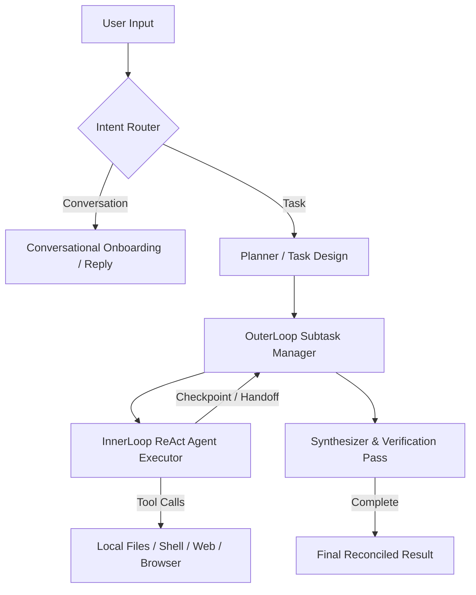

# YAAA System Architecture

This document describes the high-level architecture of Yet-Another-AI-Agent (YAAA) and is automatically updated during package builds.

## Core Conceptual Flow

## System Components

### 1. Orchestrator
- **Intent Router** (`packages/orchestrator/src/intent.ts`): Analyzes user inputs using LLMs to distinguish small talk from actionable work requests.
- **Planner** (`packages/orchestrator/src/planner.ts`): Formulates structured, dependency-aware plans.
- **Synthesizer** (`packages/orchestrator/src/synthesizer.ts`): Reconciles execution outcomes and performs final verification reviews.

### 2. Runtime Execution
- **OuterLoop** (`packages/agents/src/runtime/outer-loop.ts`): Coordinates concurrent subtask execution, negotiate verification passes, and course-corrects worker agents.
- **InnerLoop** (`packages/agents/src/runtime/inner-loop.ts`): Orchestrates individual ReAct agents as LangGraph executors, managing local file access, sandboxed commands, and browser sessions.

### Specialist Agents Roster

| Agent Name | Role | Capabilities | Context Window (Tokens) |
| --- | --- | --- | --- |
| **YAAA Orchestrator** | `Main Agent` | `conversation, planning, orchestrate` | `1,000,000` |
| **FilesAgent** | `FilesAgent` | `files` | `1,000,000` |
| **VerifierAgent** | `VerifierAgent` | `files` | `1,000,000` |
| **PrincipalSweAgent** | `PrincipalSweAgent` | `files, shell, browser` | `1,000,000` |
| **UiArchitectAgent** | `UiArchitectAgent` | `files, shell, browser` | `1,000,000` |
| **GraphicsEngineerAgent** | `GraphicsEngineerAgent` | `files, browser` | `1,000,000` |
| **ResearcherAgent** | `ResearcherAgent` | `files, web, browser` | `1,000,000` |
| **AdStrategistAgent** | `AdStrategistAgent` | `files` | `1,000,000` |
| **DesignerAgent** | `DesignerAgent` | `files` | `1,000,000` |
| **DocumentAgent** | `DocumentAgent` | `files, shell, browser` | `1,000,000` |
| **DevOpsAgent** | `DevOpsAgent` | `files, shell, browser` | `1,000,000` |
| **QaTesterAgent** | `QaTesterAgent` | `files, shell, browser` | `1,000,000` |
| **CvTesterAgent** | `CvTesterAgent` | `files, browser` | `1,000,000` |

### Task Workflow & States

Task statuses are dynamically managed via `tasks` table in `main.db`.

## Integration & Extension
- **MCP Integrations**: Registered and loaded dynamically to expose tools to the InnerLoop execution agent.
- **Local Filesystem**: Anchored securely to the task's jail workspace directory.
